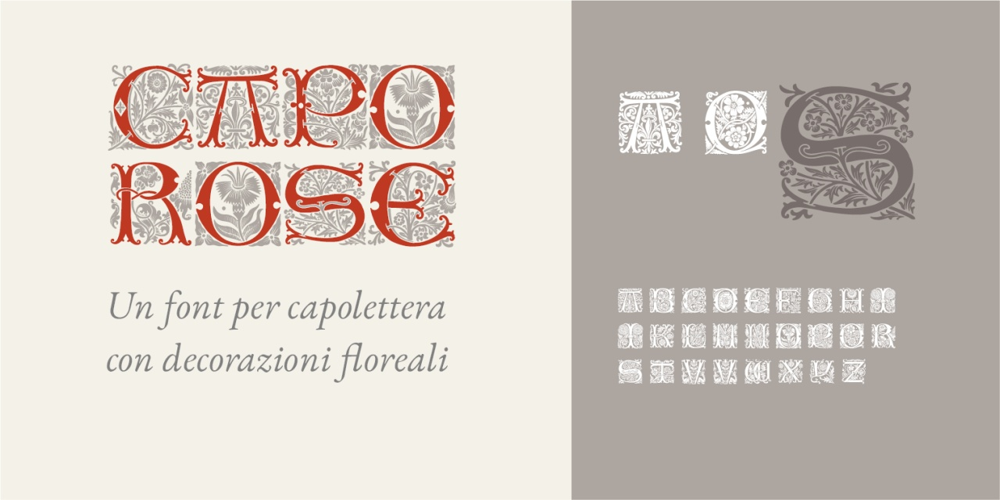
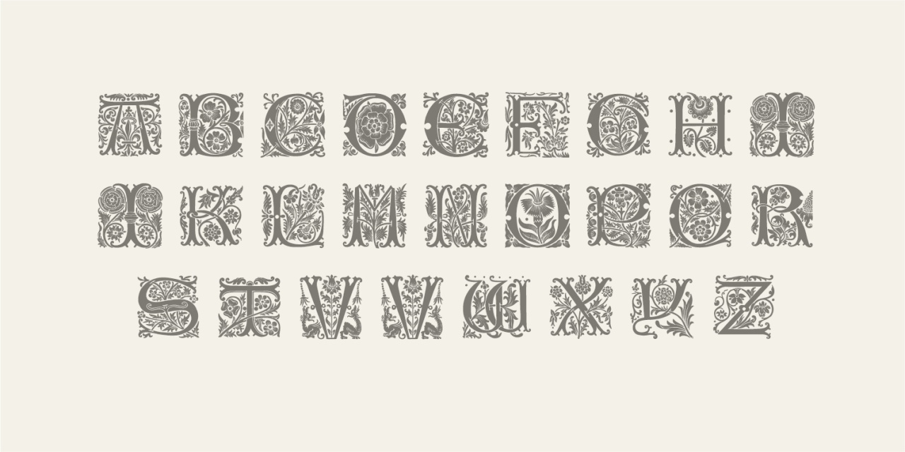
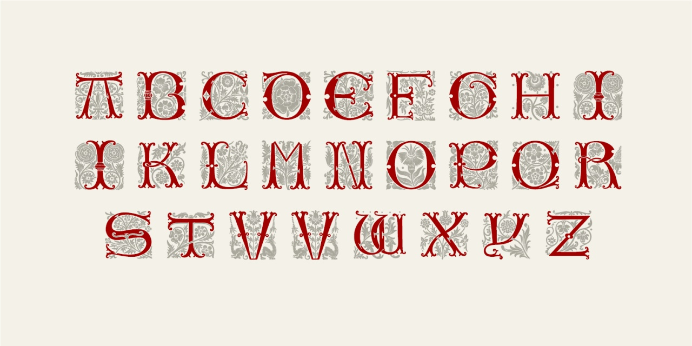

# Capo Rose
- Versione 1.0: versione iniziale

Per testare il font, vedere la [pagina interattiva](https://m-casanova.github.io/CapoRose/).

## Descrizione

Il font "Capo Decoro" è derivato da un [alfabeto pubblicato nell'Ottocento](https://archive.org/details/alphabetsnumeral00shaw/page/n47/mode/2up), ma derivato da un capolettera utilizzato agli inizi del Cinquecento per la pubblicazione del _Roman de la rose_.

Sono disponibili solo i caratteri maiuscoli da A a Z (per le lettere J e U sono utilizzate I e V).

È possibile creare una versione bicolore utilizzando le caratteristiche 'ss01' (lettera) e 'ss02' (sfondo).

